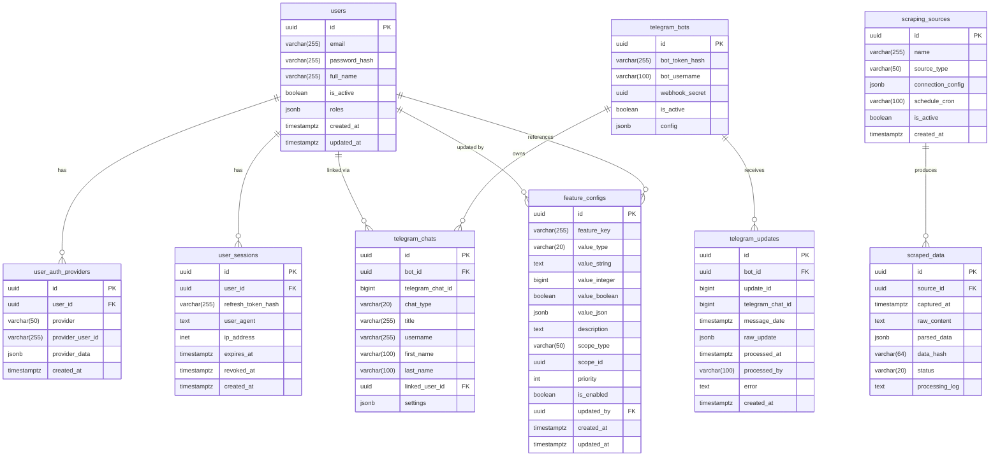
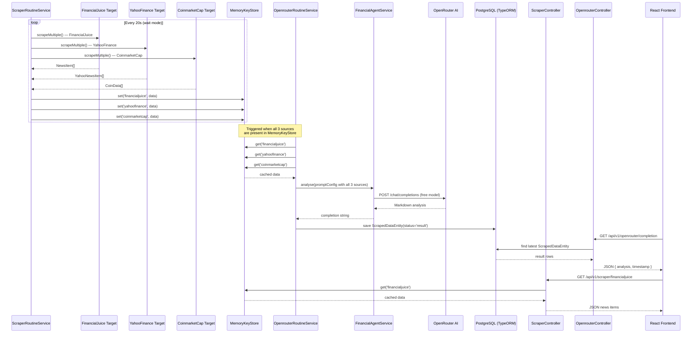

# Design

## Database Schema

```mermaid
erDiagram
    users ||--o{ user_auth_providers : "has"
    users ||--o{ user_sessions : "has"
    users ||--o{ telegram_chats : "linked via"
    users ||--o{ feature_configs : "updated by"

    telegram_bots ||--o{ telegram_chats : "owns"
    telegram_bots ||--o{ telegram_updates : "receives"

    scraping_sources ||--o{ scraped_data : "produces"
    feature_configs }o--|| users : "references"

    users {
        uuid id PK
        varchar(255) email
        varchar(255) password_hash
        varchar(255) full_name
        boolean is_active
        jsonb roles
        timestamptz created_at
        timestamptz updated_at
    }

    user_auth_providers {
        uuid id PK
        uuid user_id FK
        varchar(50) provider
        varchar(255) provider_user_id
        jsonb provider_data
        timestamptz created_at
    }

    user_sessions {
        uuid id PK
        uuid user_id FK
        varchar(255) refresh_token_hash
        text user_agent
        inet ip_address
        timestamptz expires_at
        timestamptz revoked_at
        timestamptz created_at
    }

    telegram_bots {
        uuid id PK
        varchar(255) bot_token_hash
        varchar(100) bot_username
        uuid webhook_secret
        boolean is_active
        jsonb config
    }

    telegram_chats {
        uuid id PK
        uuid bot_id FK
        bigint telegram_chat_id
        varchar(20) chat_type
        varchar(255) title
        varchar(255) username
        varchar(100) first_name
        varchar(100) last_name
        uuid linked_user_id FK
        jsonb settings
    }

    telegram_updates {
        uuid id PK
        uuid bot_id FK
        bigint update_id
        bigint telegram_chat_id
        timestamptz message_date
        jsonb raw_update
        timestamptz processed_at
        varchar(100) processed_by
        text error
        timestamptz created_at
    }

    scraping_sources {
        uuid id PK
        varchar(255) name
        varchar(50) source_type
        jsonb connection_config
        varchar(100) schedule_cron
        boolean is_active
        timestamptz created_at
    }

    scraped_data {
        uuid id PK
        uuid source_id FK
        timestamptz captured_at
        text raw_content
        jsonb parsed_data
        varchar(64) data_hash
        varchar(20) status
        text processing_log
    }

    feature_configs {
        uuid id PK
        varchar(255) feature_key
        varchar(20) value_type
        text value_string
        bigint value_integer
        boolean value_boolean
        jsonb value_json
        text description
        varchar(50) scope_type
        uuid scope_id
        int priority
        boolean is_enabled
        uuid updated_by FK
        timestamptz created_at
        timestamptz updated_at
    }
```

## Sequence

```mermaid
sequenceDiagram
    participant SR as ScraperRoutineService
    participant FJ as FinancialJuice Target
    participant YF as YahooFinance Target
    participant CMC as CoinmarketCap Target
    participant MS as MemoryKeyStore
    participant OR as OpenrouterRoutineService
    participant FA as FinancialAgentService
    participant ORS as OpenRouter AI
    participant TY as PostgreSQL (TypeORM)
    participant CT as ScraperController
    participant OC as OpenrouterController
    participant FB as React Frontend

    loop Every 20s (wait mode)
        SR->>FJ: scrapeMultiple() — FinancialJuice
        SR->>YF: scrapeMultiple() — YahooFinance
        SR->>CMC: scrapeMultiple() — CoinmarketCap

        FJ-->>SR: NewsItem[]
        YF-->>SR: YahooNewsItem[]
        CMC-->>SR: CoinData[]

        SR->>MS: set('financialjuice', data)
        SR->>MS: set('yahoofinance', data)
        SR->>MS: set('coinmarketcap', data)
    end

    Note over OR,MS: Triggered when all 3 sources<br>are present in MemoryKeyStore

    OR->>MS: get('financialjuice')
    OR->>MS: get('yahoofinance')
    OR->>MS: get('coinmarketcap')
    MS-->>OR: cached data

    OR->>FA: analyse(promptConfig with all 3 sources)
    FA->>ORS: POST /chat/completions (free model)
    ORS-->>FA: Markdown analysis
    FA-->>OR: completion string

    OR->>TY: save ScrapedDataEntity(status='result')

    FB->>OC: GET /api/v1/openrouter/completion
    OC->>TY: find latest ScrapedDataEntity
    TY-->>OC: result rows
    OC-->>FB: JSON { analysis, timestamp }

    FB->>CT: GET /api/v1/scraper/financialjuice
    CT->>MS: get('financialjuice')
    MS-->>CT: cached data
    CT-->>FB: JSON news items
```
